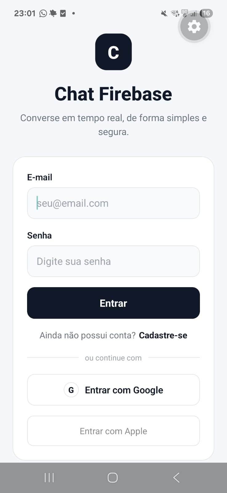
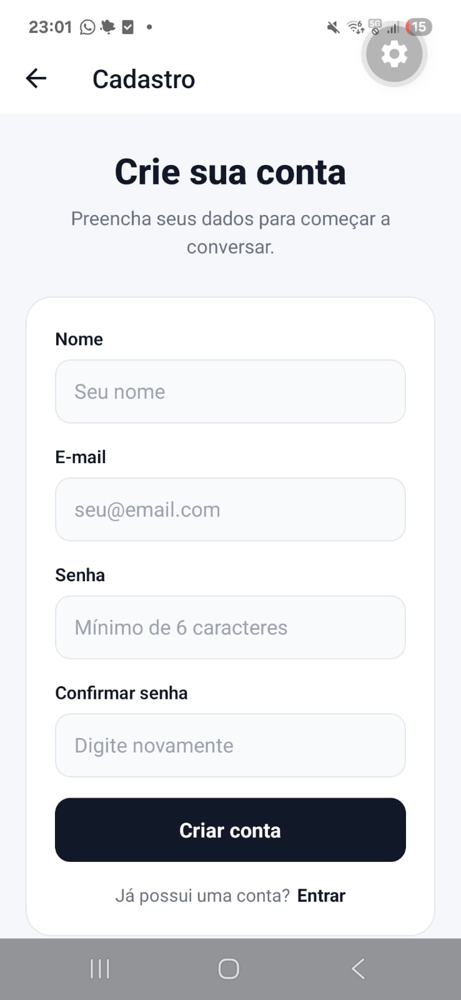
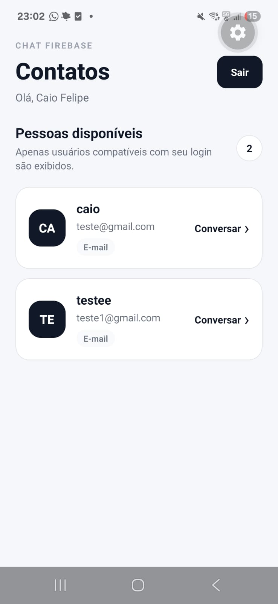
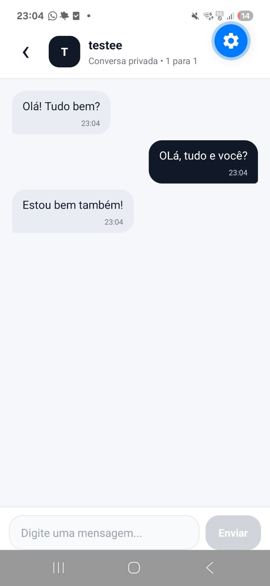
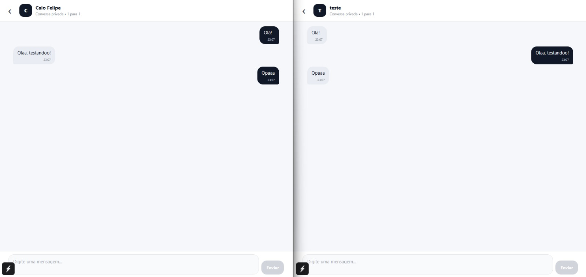

# CP1 - Chat Firebase

Aplicativo de chat 1 para 1 desenvolvido em **React Native com TypeScript**, utilizando **Firebase Authentication** para autenticação e **Firebase Realtime Database** para persistência e atualização das mensagens em tempo real.

## Integrantes

- **RM565065 - Augusto Barcelos Barros**
- **RM556197 - Caio Felipe de Lima Bezerra**
- **RM555541 - Juan Francisco Alves Muradas**
- **RM555931 - Lucas Derenze Simidu**
- **RM554873 - Sofia Fernandes**

## Tecnologias utilizadas

- React Native
- TypeScript
- Expo SDK 55
- Firebase Authentication
- Firebase Realtime Database
- React Navigation
- AsyncStorage
- Expo Dev Client

## Funcionalidades

- Cadastro e login com e-mail e senha
- Login com Google
- Login com Apple implementado para iOS
- Logout
- Listagem de contatos compatíveis
- Chat exclusivo entre duas pessoas
- Mensagens armazenadas no Firebase Realtime Database
- Atualização das mensagens em tempo real
- Diferenciação visual entre mensagens enviadas e recebidas
- Tratamento de loading e erros
- Regras de segurança no Realtime Database

## Regra de comunicação entre provedores

As conversas respeitam a seguinte regra:

### Permitido

- E-mail/Senha ↔ Google
- E-mail/Senha ↔ Apple

### Não permitido

- E-mail/Senha ↔ E-mail/Senha
- Google ↔ Google
- Apple ↔ Apple
- Google ↔ Apple

O usuário também não pode iniciar uma conversa consigo mesmo.

## Firebase

O projeto utiliza:

### Firebase Authentication

Responsável pelo cadastro, login e identificação dos usuários através dos provedores:

- E-mail/Senha
- Google
- Apple

### Firebase Realtime Database

Responsável pelo armazenamento de:

- Usuários
- Conversas
- Participantes
- Mensagens
- Remetente
- Destinatário
- Data/hora das mensagens

As mensagens são atualizadas automaticamente através de listeners do Realtime Database.

## Configuração básica do Firebase

Para executar o projeto utilizando outro ambiente Firebase:

1. Crie um projeto no Firebase Console.
2. Ative o **Firebase Authentication**.
3. Habilite os provedores **E-mail/Senha**, **Google** e **Apple**, conforme o ambiente disponível.
4. Crie um **Firebase Realtime Database**.
5. Configure as regras de segurança do banco.
6. Cadastre os aplicativos Web, Android e iOS quando necessário.
7. No Android, configure o SHA-1 para o Google Sign-In e adicione o arquivo `google-services.json`.
8. Atualize a configuração Firebase utilizada em `src/services/firebase.ts`.

## Estrutura do projeto

```text
src/
├── components/
├── contexts/
├── hooks/
├── screens/
├── services/
├── styles/
├── types/
└── utils/
```

### Principais responsabilidades

- `components/`: componentes reutilizáveis da interface
- `contexts/`: contexto global de autenticação
- `hooks/`: hooks personalizados, como autenticação e chat
- `screens/`: telas de Login, Cadastro, Contatos e Chat
- `services/`: integração com Firebase e provedores de autenticação
- `styles/`: tema e estilos compartilhados
- `types/`: tipos TypeScript
- `utils/`: regras auxiliares, incluindo compatibilidade entre provedores

## Como executar

### Pré-requisitos

- Node.js 20 ou superior
- npm
- Git

### Clone o repositório

```bash
git clone https://github.com/caiofelipe1/cp1-chat-firebase.git
cd cp1-chat-firebase
```

### Instale as dependências

```bash
npm ci
```

### Web

```bash
npx expo start
```

Depois pressione:

```text
w
```

### Android com Development Build

O Google Sign-In nativo utiliza módulos que não fazem parte do Expo Go. Para testar todas as funcionalidades no Android, utilize a Development Build do projeto.

Com a build instalada:

```bash
npx expo start --dev-client
```

## Validação do projeto

O projeto pode ser validado com:

```bash
npx tsc --noEmit
npx expo-doctor
```

Na validação final, o Expo Doctor apresentou:

```text
20/20 checks passed
```

O código-fonte também foi verificado para não utilizar `any`.

## Prints da aplicação

Crie a pasta:

```text
docs/images/
```

E adicione os prints com os seguintes nomes:

### Login



### Cadastro



### Contatos



### Chat



### Chat em tempo real



